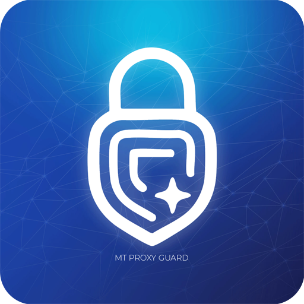

# 🔐 MtProxy Guard Bot | Your Gateway to Secure Telegram Access
<div align="center">


</div>
<div align="center">
  <a href="https://t.me/MtProxySG_bot"></a>
  <a href="https://t.me/MtProxySG"></a>
  
  
</div>

## 🌊 Sail Through Digital Barriers

In a world where digital freedom faces increasing challenges, **MtProxy Guard Bot** (@MtProxySG_bot) stands as your trusted navigator. Our mission is simple: provide seamless, secure access to Telegram through high-quality MTProxies that work when you need them most.

## ✨ Why Choose MtProxy Guard Bot?

Our bot isn't just another proxy provider—it's a comprehensive solution crafted with users in mind:

### 🛡️ Core Capabilities
| Feature | Description |
|---------|-------------|
| 🌏 **Global Coverage** | Access to proxies spanning 18+ countries worldwide |
| 🔄 **Daily Refreshed** | New proxies added daily to ensure consistent performance |
| 🔍 **Smart Selection** | Find proxies by country, data center, or performance metrics |
| ⚡ **Lightning Fast** | Optimized for speed without compromising security |
| 📊 **Detailed Stats** | Comprehensive information about each proxy's performance |
| 🔐 **Secure Access** | Enhanced protection for your Telegram communications |

### 🚀 User Experience
- **Intuitive Interface**: Simple commands and clean menus
- **Instant Connection**: From selection to connection in seconds
- **24/7 Availability**: Access new proxies whenever you need them
- **Zero Technical Hassle**: No complex setup required

## 📖 Tutorial
Check out our comprehensive tutorial in our Telegram channel: [MtProxy Guard Bot Tutorial](https://t.me/MtProxySG/10)

## 🧭 Navigation Guide

```
START → CHOOSE PROXY TYPE → SELECT LOCATION → CONNECT → ENJOY FREEDOM
```

1. **First Contact**: Send `/start` to [@MtProxySG_bot](https://t.me/MtProxySG_bot)
2. **Explore Options**: Choose from free or premium proxies
3. **Refine Your Search**: Filter by country or data center (DC)
4. **Make Your Selection**: Pick the proxy that meets your needs
5. **Connect Securely**: Follow the simple connection instructions
6. **Experience Freedom**: Enjoy uninterrupted access to Telegram!

## 💎 Premium Experience

For those who demand nothing but the best, our **Premium Proxies** deliver excellence:

### ✨ Premium Advantages
- **🚄 Superior Speed**: Optimized for maximum performance
- **📦 Generous Bandwidth**: 100GB allocation for your needs
- **📅 Extended Validity**: Full 30-day usage period
- **🛑 Ad-Free Experience**: No forced channel subscriptions
- **🛡️ Enhanced Security**: Additional protection layers
- **📱 Priority Support**: Dedicated assistance when needed

<div align="left">
  
</div>

## 🤝 Community

Join our growing community of users who value digital freedom:

- **Updates Channel**: [@MtProxySG](https://t.me/MtProxySG)
- **Share**: Help friends and family connect securely
- **Feedback**: Your input helps us improve

## 📜 License

[MIT License](LICENSE.md) - Feel free to use and modify within the terms of our license.

## 📞 Contact

- **Support**: Direct message to [@thejan_go](https://t.me/thejan_go)

---
<div align="center">
  <p>Crafted with ❤️ for the global Telegram community</p>
  <p>Empowering secure connections since 2023</p>
</div>